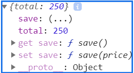

# 屬性特徵
屬性就是 key/value 的組合，但除此之外，還有一些屬性的**設定**藏在裡面，這些屬性的**設定**稱為**屬性的特徵**，而設定這些屬性特徵的函式就把它稱為 **屬性描述器**，就算沒有屬性描述器，依然可以撰寫 JavaScript，但使用屬性描述器可以讓**程式更為強健**。

#### 屬性特徵有以下六種：
-   value => 要修改或賦予的值。
-   writable => 可否進行屬性質的(預設為`true`)。
-   configurable => 可否可以用 delete 刪除屬性 (預設為`true`)。
-   enumerable => 可否利用 **for...in 迴圈**將物件屬性列舉出來 (預設為`true`)。
-   get  取值器
-   set  設值器

而這些特徵都是透過**屬性描述器**去設定的  `Object.defineProperty` (一次設定一個屬性) 與  `Object.definedProperties`(一次設定多個屬性) 
#### Object.defineProperty
```
var obj = {  
  a: 1,
  b: 2,
  c: 3 
};

Object.defineProperty(obj, 'a', {
  value : 4 
})
console.log(obj) // {a: 4, b: 2, c: 3}

Object.defineProperty(obj, 'a', {
  writable : false ,
}) 
obj.a = 5 ;  // 在嚴格模式下這行將會跳錯，因為屬性值是不可寫入。
console.log(obj) // {a: 4, b: 2, c: 3}

Object.defineProperty(obj, 'b', {
  configurable : false ,
})
//delete obj.a ; //可刪除
delete obj.b ; //不可刪除
console.log(obj) // {b: 2, c: 3}

Object.defineProperty(obj, 'c', {
  enumerable : false ,
})
for (var key in obj) {
  console.log('列舉', key) // 列舉 a 列舉 b
} 
```
透過Object.defineProperty新增屬性或物件 :
```
var obj = {  
  a: 1,
  b: 2,
  c: 3 
};
Object.defineProperty(obj, 'd', { 
  value: {},
  writable: false
 })
obj.d = 5
obj.d.a = 6
console.log(obj)
```
這個禁止寫入只限定於`d`這個屬性，由於物件本身是**傳參考的特性**，所以一樣**可以對`d`裡面的值做額外的設定**，而`defineProperty`只能對**當下的屬性做限制**，如果是新增一個物件則**沒辦法對子屬性作限制**，也就是**淺層保護**。
#### Object.definedProperties
一次設定多個屬性
```
var obj = {  
  a: 1,
  b: 2,
  c: 3 
};
Object.definedProperties(obj,{
  a: {
     修改屬性特徵...
  },
  b: {
     修改屬性特徵...
  },
  c: {
     修改屬性特徵...
  }
})
```
####  物件擴充的修改與調整
以下有3 種方法來針對整個物件進行調整，如果我們想要知道某個物件的某個屬性的特徵的話，可以利用 `Object.getOwnPropertyDescriptor(物件, 屬性名稱)` 的方式來查看，就會回傳一個物件包含該屬性的4個特徵。
* preventExtensions => **防止物件進行屬性的擴充(新增屬性)**，但是**刪除或是重新賦予值都還是可以**。
  *  `Object.isExtensible(person)` 來檢查他是否可以擴充，這邊會回傳布林值來確認是否可以被擴充。
  *  在`preventExtensions`防止擴充後，可以對其他屬性特徵做調整。
  ```
  var obj= { 
     a: 1,
     b: 2,
     c: {} 
  };

  Object.preventExtensions(obj);
  console.log('是否可以被擴充', Object.isExtensible(obj)) //是否可被擴充 false

  //調整屬性(可調整)
  obj.a = 'a';
  
  //新增屬性(無法被擴充)
  obj.d = 'd'; 
  
  //巢狀屬性調整(防止擴充是沒有辦法對巢狀屬性去做調整，因此還是可以新增子屬性)
  obj.c.a = 'ca'; 
  console.log(obj)
  ```
* seal => 讓物件的屬性**無法新增、刪除**，**也無法重新配置特徵**。但是**可以調整前屬性值(value)**，同時，物件預設會加上**preventExtensions**。
  *  `Object.isSealed(obj)`來檢查他是否可以封裝，這邊會回傳布林值來確認是否可以被擴充。
  * 使用`seal `物件的屬性特徵`configurable` 將會改為**false**。
  * 使用`seal `後**無法再調整其他屬性特徵。
 ```
  var obj= { 
     a: 1,
     b: 2,
     c: {} 
  };

  Object.seal(obj);
  console.log('是否可以被擴充', Object.isExtensible(obj)) //是否可被擴充 false
  console.log('是否可以被封裝', Object.isSealed(obj)) //是否被封裝 true
  console.log('obj a 的屬性特徵', Object.getOwnPropertyDescriptor(obj, 'a')) //在這裡的屬性特徵configurable 是false
  
 //調整屬性(可調整)
  obj.a = 'a';
  
 //新增屬性(無法被擴充)
  obj.d = 'd'; 
  
 //巢狀屬性調整(防止擴充是沒有辦法對巢狀屬性去做調整，因此還是可以新增子屬性)
  obj.c.a = 'ca';
  
 //刪除屬性(無法刪除)
 delete obj.b
 
 console.log(obj)
  ```
 
* freeze => 跟 `seal` 很像，`freeze`的物件**無法新增刪除**、**不可以調整前屬性值(value)**，當然也**也無法重新配置特徵**。
  * `Object.isFrozen(obj)`來檢查他是否被凍結，這邊會回傳布林值來確認是否可以被擴充。
  * 使用`freeze`物件的屬性特徵`writable`、 `configurable`將會改為**false**。
  * 使用`freeze`後**無法再調整其他屬性特徵。
 ```
  var obj= { 
     a: 1,
     b: 2,
     c: {} 
  };

  Object.seal(obj);
  console.log('是否可以被擴充', Object.isExtensible(obj)) //是否可被擴充 false
  console.log('是否可以被封裝', Object.isSealed(obj)) //是否被封裝 true
  console.log('是否可以被封裝', Object.isFrozen(obj)) //是否被凍結 true
  console.log('obj a 的屬性特徵', Object.getOwnPropertyDescriptor(obj, 'a')) //在這裡的屬性特徵configurable 是false
  
 //調整屬性(不可調整)
  obj.a = 'a';
  
 //新增屬性(無法被擴充)
  obj.d = 'd'; 
  
 //巢狀屬性調整(防止擴充是沒有辦法對巢狀屬性去做調整，因此還是可以新增子屬性)
  obj.c.a = 'ca';
  
 //刪除屬性(無法刪除)
 delete obj.b
 
 console.log(obj)
  ```
 ### 取值器 與 設值器
Getters 和 Setters 使你可以快速**獲取**或**設定**一個**物件的資料**。可以直接把**值覆蓋過原本的值**，有時候我們也會需要根據**原本的值進行一些運算**，這種狀況就非常適合使用 Getter 與 Setter!，而Setters使用方法為`set`作為字首，Getters則使用`get`，接著接上自定義名稱，再加上(){}，有點類似傳統函式，但少了 function 的開頭宣告。之後也是將要進行運算的程式撰寫在大括號內，就算定義完成。
範例:
```
var wallet = { 
  total: 100,
  set save (price) { 
    this.total += price / 2;
  },
  get save () { 
    return  this.total;
  }
};

//如果有參數的話，則利用 = 要帶入的參數傳入，
wallet.save = 300;
//執行的話，只需要使用表達式即可，wallet.save
wallet.save ; // 250
console.log(wallet.total);  // 250
```
接著把wallet 這個物件印出來`console.log(wallet)`會發現可以看到 total下還有一個 `(...)` 如果我們點下去之後，才會從點下去的當下去資料中取這個值 ，也就是說，按下去的當下，js的程式碼都全部跑完了，才去取得處理完的資料狀態，也就是250。

### 使用 Object.defineProperty( ) 定義 Getter 以及 Setter
除了在物件上定義還可透過Object.defineProperty()來使用Getters 和 Setters
範例 :
```
var wallet = { 
  total: 100
 };
 
Object.defineProperty( wallet, 'save', {
  set: function (price) { 
  this.total += price / 2;
  },
  get: function () { 
    return  this.total;
  } 
});

wallet.save = 300; // 250
wallet.save // 250
console.log(wallet.total);  // 250
```
如同之前的寫法所示，功能一樣可以照常運作，但把它印出來看`console.log(wallet)`可以發現 `save: (...)` 的屬性顏色跟之前的不一樣，變成淡紫色。
使用`Object.getOwnPropertyDescriptor(wallet, 'save')`來查看屬性特徵
可以發現`configurable` 以及 `enumerable`的狀態是 `false`。形成這樣的原因是因為根據預設，被加到物件且使用Object.defineProperty( )的值都是**不可變物件(Immutable)**。
如果要修改成 true 的話也很簡單，只需要 Object.defineProperty 中進行調整就可以了。
```
Object.defineProperty(wallet, 'save', { 
  configurable:true,
  enumerable: true,
  set: function (price){
    this.total += price / 2;
  },
  get: function () {
    return  this.total;
  } 
});
console.log('GetterandSetter',Object.getOwnPropertyDescriptor(wallet, 'save'));
```
使用 Getter 以及 Setter來新增方法分別取的陣列索引前後的值。
```
var a = ['1', '2', '3'];
Object.defineProperties(Array.prototype, {
  getFirst: { 
     get: function () { 
       return  this[0];
     } 
  },
  getLast: { 
    get: function () {
      return  this[this.length - 1]; }
    } 
});
console.log('getFirst', a.getFirst); 
console.log('getLast', a.getLast);
```
